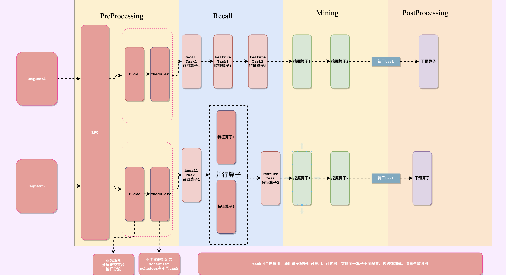
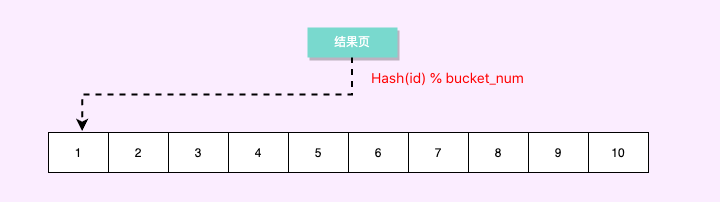
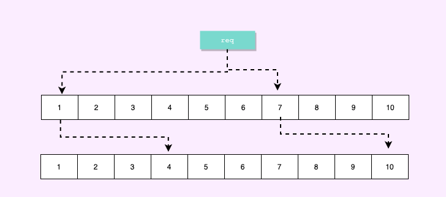

# UniTask - 推荐策略工程框架
[](https://github.com/MachinePlay/DemoServer/actions/workflows/docker-image.yml)
谷歌的[`Live at Head`](https://abseil.io/about/philosophy)思想，是一个非常不错的想法，我们崇尚尽可能地去尝试使用最新版本的依赖和功能，推荐使用最新master主干提交版本。  
Project now follows the Abseil Live at Head philosophy. We recommend using the latest commit in the master branch in your projects.

# 依赖管理
C++的依赖管理一直以来是一个问题，项目使用CMake管理依赖，并且引入现代CMake的`FetchContent`依赖版本管理能力，编译前下载指定版本依赖库，从源码编译依赖库，这样做会带来一些编译期成本，但也能带来版本管理和迭代效率提升：
- 依赖库代码编译成静态库随源代码发布是一种常见的做法，但是在依赖库版本升级和编译工具链升级时会很难操作，可以想象项目迭代后成百上千个依赖都需要手工升级，依次替换静态库。在复杂的系统中是一个非常艰巨的问题。通过指定版本依赖库，从源码编译，可以方便的切换依赖库版本。带来编译时长的增长换可迭代能力，方便后续代码升级。
# 策略框架


## 流程图
### 基于UniTask推荐框架的最佳实践



- 通常推荐系统架构包括召回、粗排、精排、重排，业务层组成，常见的微服务架构中，各阶段通常由多个微服务组成
- 单个服务中整体架构通常是经过各种业务策略算子，最终输出，业务策略算子通常是对全局请求进行排序、提权、打压、打分、请求特征服务、请求ModelServer、请求补充Meta信息等等操作，每个算子都可以看作是对该次请求全局数据的一个Operator，在UniTask中，我们将业务算子称为Task。
- Flow是一份用户请求，通常会根据业务场景、抽样被抽样到不同的业务流中，一个Flow绑定一个Scheduler
- Scheduler是一系列算子的集合，即该模块一次推荐请求要通过的Task的集合

业务流量通过RPC请求进入服务后，进入业务线程，根据业务场景、抽样分流成不同的Flow，Flow绑定Scheduler，调度具体的业务算子，不同的scheduler可以通过task的不同组合实现线上流量的A/B Test，同一个task可以通过不同业务配置和别名（aliasname）在不同的scheduler中复用，实现高扩展性。

# 抽样实验
抽样实验，即在保证线上稳定性的条件下，抽取部分线上流量，供策略实验
抽样的核心问题在于：  

- 1.如何抽取部分流量
- 2.新策略如何在抽取的流量下生效

## 流量切分
一般线上抽样可以根据用户标识做处理，选定的用户标识可能是
- 设备id
- 账号id
- ip
- 和某些业务相关的，比如某个场景必中

  通用的做法是将线上流量均分到若干份（例如，10000份），通过hash算法，对用户标识取模（`hash(uid) % 10000`）  
  
  一般情况下，抽样需要保证用户在一定时间内稳定中流量

- 为用户提供稳定的效果，防止对体验造成伤害
- 保持实验效果，用户需要经过一段时间的体验，才能对实验有稳定的反馈
  流量的切分关键在于hash算法的均衡性，流量比较大的情况下，一般是可以保证均衡（流量规模过小不能置信）

# 分层实验
如果一个实验能抽取1%对流量，那么最多线上可以做100个实验，基本可以满足一个（“小作坊”）团队的需求， 对于流量比较少的公司/业务来说，线上的流量可能最多分成十组


一般一个实验2～3周可以得出结论，扩充流量或者转全量，流量会逐步释放出来，但是当并行的实验太多，随着策略模型对不断迭代，不同模块，不同层都需要做实验，线上的实验数量是有限制的，这样的单层实验就不能满足需求了  


这样的情况下，我们引入`正交实验`和`互斥实验`这个概念，可以提出流量分层的概念，线上流量可以分为N个虚拟的流量层，流量会经过每一个流量层，同层之间的实验显然不会同时命中，同层之间的实验是`互斥实验`，不同层之间是`正交试验`。  


通过这种分层，线上支持的实验个数将大大增加，线上的A/B评估实验，即实验组和对照组在多层之间是正交的，即在某一层流量也会均匀的分不到其他层上 


这样做的目的是为了消除其他实验对评估实验的影响， 具体说明如下：

- 假定有实验1， 实验组exp_a和对照组base_a 各分配1%流量，做AB评估
- 假定有实验2， 其和实验1不在同一个流量层，实验组other分配了2%的流量
- 由于正交性，同时满足 (exp_a, other)的请求和同时满足(exp_b, other)的请求个数相当，这样other对exp_a和exp_b的影响是一样的， 理论上在exp_a， exp_b的对比评估中影响可以抵消


# 快速开始


# 高版本GCC
使用GCC10，利用高版本GCC的语言新特性和编译器优化能力

- LTO ：Link Time Optimized， 优化多目标文件中的指令排布和冗余精简
- PGO：Profiling Guide Optimized， 利用运行时数据对程序进行二次优化

# 单元测试

- 代码本身使用GTEST单元测试

  可以通过单元测试内CMake单独编译单元测试

  ```shell
  cd test/build
  cmake ..
  make -j8
  ./gctest
  ```

  也可以通过docker-compose，容器化地启动单测

  ```
  docker-compose -f ./docker-compose-unittest.yml up
  ```

  GoogleTest通过即可：

  

  # 持续集成

  项目已支持容器启动，runtime通过打包成docker image完成，可在容器内开发，编译

  ```
  docker compose up -d
  docker exec -ti container_name /bin/bash
  ```

  项目通过github action配置了持续集成流水线，代码push到Github会自动触发github action，自动触发单元测试


# 服务目录树
- C++缺少好的依赖管理和组件化工具，我们用CMake做代码管理，DIY
- 各种功能组件应该分开在各自定目录存放，避免都写到一起
- 开源依赖可以以静态库的方式存放，也可通过CMake版本依赖配置远程代码仓库和指定版本号，每次随模块从源码编译
- 每次变更应该有单元测试
- 使用Github自带的Action来构建持续集成，有代码提交自动CI，通过容器化的单元测试才可以合入，后续考虑加入更多CI功能
- 服务本身要有容器化启动能力，例如带有docker compose，可以一键构建环境、启动  

- 代码结构  
```
DemoServer                                                  //服务代码库，每个服务一个代码库，独立管理，避免耦合，自主空间大
├── CMakeLists.txt                                          //主要代码组织
├── LICENSE                                                 //协议
├── README.md                                               //说明
├── build                                                   //主程序构建文件夹，提交代码时应该把里面的内容删除
├── conf                                                    //配置文件，仅线下使用，线上通过配置中心拉取
├── database                                                //组件库，例如这个文件夹可以放封装的数据库操作
├── docker-compose-unittest.yml                             //单元测试 容器启动
├── docker-compose.yml                                      //开发、运行时容器
├── frame                                                   //组件库，例如这里可以放核心引擎等
├── proto                                                   //依赖的proto
│   ├── EchoServant.h
│   └── EchoServant.tars
├── protogen                                                //依赖的proto
├── server                                                  //主程序 
│   ├── CMakeLists.txt
│   ├── EchoServantImp.cpp
│   ├── EchoServantImp.h
│   ├── EchoServer.cpp
│   └── EchoServer.h
├── shm_manager                                             //组件库，例如这里可以放共享内存库
├── test                                                    //单元测试的组织，在内层自行组织
│   ├── CMakeLists.txt
│   ├── Makefile
│   ├── build
│   ├── conf
│   ├── testcpp.cpp
│   ├── testcpp.h
│   └── unittest.cpp
├── thirdlib                                                //开源依赖，第三方依赖，一些静态库或者Header-Only的库都可以放这里
│   ├── hiredis
│   ├── mac-protoc
│   ├── mysql
│   ├── protobuf-3.13.0
│   ├── protobuf-cpp-3.13.0.tar.gz
│   └── protoc-3.13.0.0
└── utils                                                   //可以放一些小工具
```
